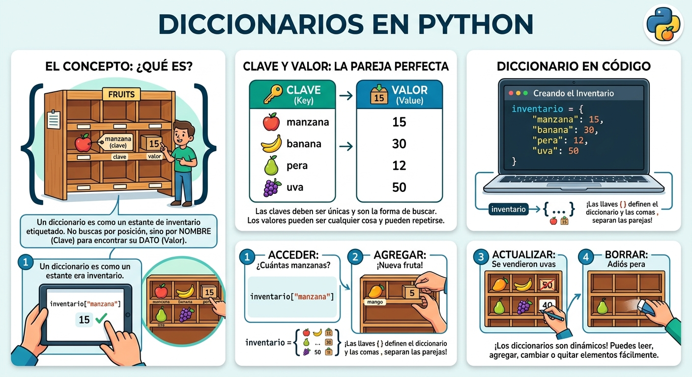

# diccionario_python
concepto y ejercicios diccionarios de python

- los diccionarios son datos estructurados, es decir, hacen referencia a una coleccion de datos 
- son una coleccion desordenada en pares de datos de la forma **clave:valor**, conocidos como elementos o items 
- son mutables, una vez definido se le pueden agregar nuevos elementos, modificar o eliminar algunos de los que ya tienen. 
- tambien son conocidos como arreglos asociativo 

## representacion grafica de un diccionario 



## sintaxis

`nombre_diccionario = {clave1:valor1, clave2:valor2,...}`

- cada item elemento tiene la forma **clace:valor**
- en cada item hay una clave y uno o mas valores. si se desconoce al valor, se puede completar con "None"
- los elementos del diccionario sen indexan por la clave.
- las clases solo pueden ser datos inmutables.
- las claves no pueden repetirse dentro de un diccionario.


## ejemplo

`frutas = {`manzana` :34, `pera`:45}`

## operaciones 

### agregar elementos 

`nombre_diccionario[clave] = valor`

`frutas[`cereza`] = 90`

### consultar o modificar elementos

`print(el valor de pera es: ",frutas[`pera`])`

### eleminar elementos

`del frutas[`pera`]`

### operador de pertenencia

```python
if `cereza` in frutas:
    print(`si esta cereza en el diccionario`)
else:
    print(`no esta cereza en el diccionario`)
```

### ejercicio 
Cree un programa en Python que utilice un diccionario para guardar los nombres de sus amigos y su telefono.  En este caso, el diccionario representa una agenda telefónica.  El programa pedirá nombres y telefonos y los irá guardando en el diccionario (los nombres en mayúscula).  Además, el programa debe permitir consultar o eliminar un telefono.  Incluya un menú de opciones.